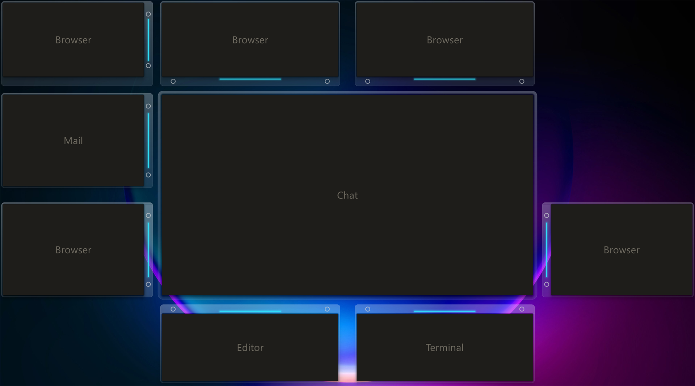

# focal-desk

> **The service runs.** [`crates/`](crates/) holds a Rust window manager that moves real Windows apps — built for, and used daily on, the 65″ 8K panel it was designed for. Every managed window wears a glass **frame**: tap it to promote, drag it to move; clicking *into* a window never moves anything. `index.html` is the original concept mock, kept as a demo — the `focal-core` tests are the spec. The wallpaper layer (flow field + wires) is still to come.

*The service on the real panel, 2026-09-04 — window contents masked; the chat window is on the stage.*

An interactive concept mock for a **focal-priority window layout** on very large screens, built around a 65″ 8K panel.

The idea: on a screen that big, your eyes live in the center — the corners are peripheral vision. So instead of edge-snapping and maximized zones, every app owns a permanent **home slot** arranged in a bullseye around a large **focal slot**. Tapping a window's frame promotes it to the focal slot; the previous occupant flies back to its own home, so spatial muscle memory never breaks. The focal slot is a stage, not a size: apps carry a **focal-fit** hint, so a terminal promotes to a tall column rather than a full-width sprawl. Windows are spaced by a structural **gutter** (set in real inches) that actively resizes windows and belongs exclusively to the **connection wires** — glowing, PCB-style routed links between related apps (hard links auto-detected, soft links drawn by hand; multiple wires leaving one window get their own ports along the edge). A slow flow-field drifts through the gaps, a nod to the Swordfish monitor rig. Panel model inspired by Meta Orion, which I personally worked on.

**Run it on Windows:** see [RUN.md](RUN.md) — install Rust, `cargo run --release`.

**Try the concept mock:** [play it in your browser](https://gadz-tech.github.io/focal-desk/) — or open `index.html` locally. Press F11 either way; single file, no dependencies. (It predates the frames and is no longer the spec.)

Controls: click a window (or `Tab` / number keys `1–9 0 - =`) to promote it; `Esc` clears focus; `C` toggles connect mode — click two windows to link or unlink them; `F` fullscreen; `?` shows all keys. Sliders set focal size, band height, and gutter width.

The service lives in [`crates/`](crates/) — `focal-core` is the OS-free brain (layout, promotion, slot rules, frame geometry and its painter, wire routing; 72 unit tests, `cargo run` prints a narrated demo) and `focal-win` is the Win32 adapter. Design map: [ARCHITECTURE.md](ARCHITECTURE.md).

Real-world behavior: a small Rust service with a per-window frame (four small per-pixel-alpha windows behind each app: tap to promote, drag to a slot; an OS foreground change is informational and never moves anything), assignable slot rules with priority, flights that animate a DWM thumbnail and resize the real window exactly once, and — still to come — a wallpaper-layer renderer for the flow and wires. The service is dock-aware: inactive on the laptop's own display, active by default in desk mode when the eGPU (GeForce RTX 5060 Ti) and the 65″ panel are attached — detected via display-topology and device hot-plug events, releasing all windows to normal behavior on undock.
